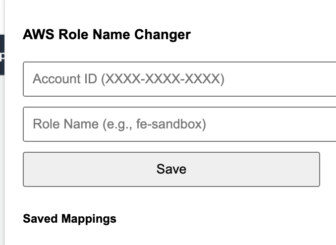

# AWS Account Display Customizer Chrome Extension
このChrome拡張はAWS IAM Identity Centerから各AWS環境にログインした際に自分がどの環境を利用しているか視覚的にわかりやすくすることを目的としています。

## 機能

- AWS IAM Identity Center経由でログインした場合、アカウント表記がアカウント名@設定されているドメイン名から、アカウント名@任意の環境名へ変更
- AWSコンソールの言語は英語および日本語に対応
- 複数のアカウントと環境名のセットを入力可能

## 注意
本Chrome拡張は、ほぼほぼ自分のために作っています。
そのため、予期しない動作や不具合などがありえます。

## 使い方

1. Chrome拡張をインストール
2. XXXX-XXXX-XXXXの形式でAWSアカウントIDを入力し、表示したい環境名を入力
  e.g. 1234-5678-9012: analytics-sandbox

# AWS Account Display Customizer Chrome Extension
This Chrome extension aims to make it visually clear which environment you are using when you log in to various AWS environments through AWS IAM Identity Center.

# Features
- When logged in through AWS IAM Identity Center, the account display changes from account name@configured domain name to account name@custom environment name.
- Supports both English and Japanese for the AWS console language.
- Allows input of multiple account and environment name pairs.

# Note
This Chrome extension is primarily created for personal use. Therefore, unexpected behavior or issues may occur.

# Usage
1. Install the Chrome extension.
2. Enter your AWS account ID in the format XXXX-XXXX-XXXX and the desired environment name.